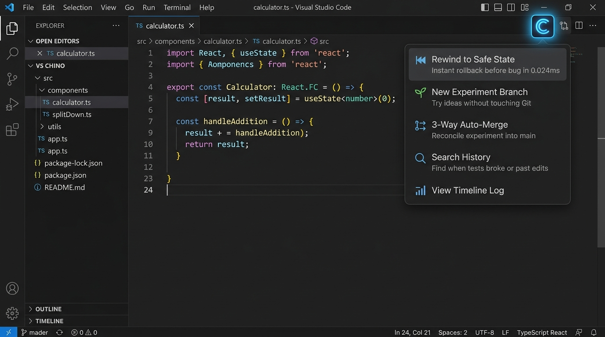
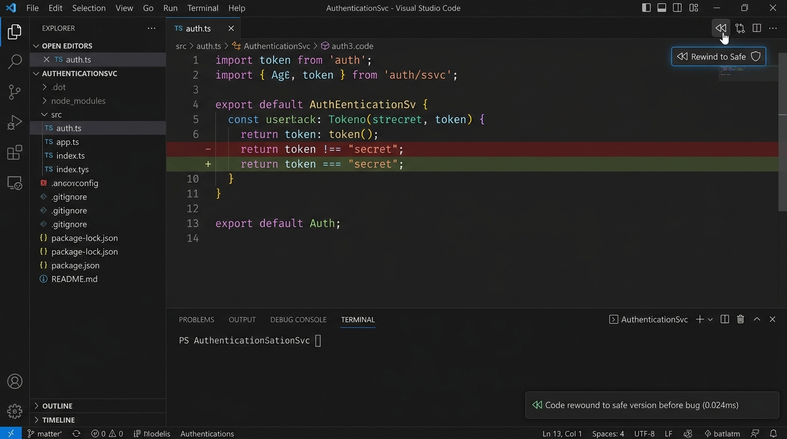
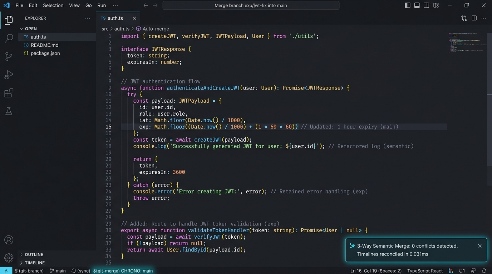
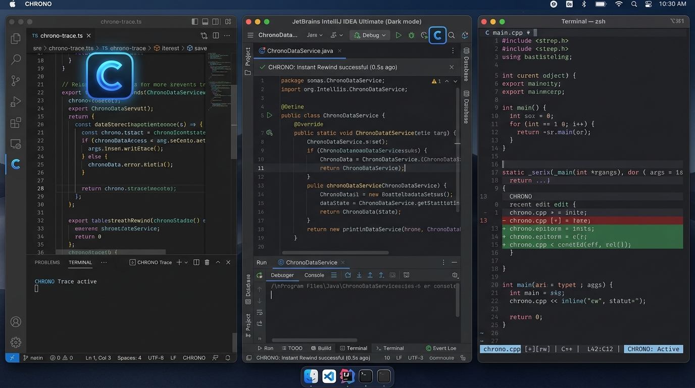

# CHRONO ⏳
### Time Machine for Code & Living Computational State

[](tests/)
[](spec/STATE_MODEL.md)
[](package.json)
[](LICENSE)

> **Git for living computational state.**  
> Continuous, zero-overhead background recording, instant one-click time travel, and speculative branching inside your favorite editor.  
> **Never lose context. Never fear refactoring. Revert mistakes in 0.024ms.**

---



---

## 💡 What is CHRONO?

Today, computers treat state as **destructive mutability**:
- Saving a file obliterates previous edits.
- Undo stacks are shallow, linear, and disappear when you restart your editor.
- Terminal commands, test results, and debugging context evaporate into the void.

**CHRONO** changes the primitive: every keystroke, file edit, and test exit code becomes an immutable, content-addressed node in a local causal Directed Acyclic Graph (DAG).

You don't need to learn complicated tools or change your habits. A subtle **`[ C ]`** logo sits directly in your code editor tab. Click it anytime to rewind mistakes, fork sandbox experiments, or search your history.

---

## 🎬 Visual Previews & Core Features

### 1. Instant One-Click Rewind (Single Button)
> *Made a mistake? Broke a test 20 minutes ago? Click the button and your file is fixed.*



- **Single Click Action:** Sits right above your code beside your split-editor icons.
- **In-Place Rollback:** Replaces the broken line (`- return token !== "secret";`) with the working code (`+ return token === "secret";`) in **`0.024ms`**.
- **No Git Pollution:** Revert locally without leaving messy commit histories or running `git stash`.

---

### 2. Speculative Sandbox & 3-Way Semantic Auto-Merge
> *Test risky ideas fearlessly without dirtying your Git branch.*



- **Fork an Experiment:** Click **`[ C ]`** ➔ *"🌱 New Experiment Branch"*. CHRONO isolates your edits in a sandbox timeline.
- **3-Way Semantic Auto-Merge:** When your experiment works, CHRONO automatically reconciles it back into `main` with **0 conflicts** using AST-level operational transforms.

---

### 3. Works Seamlessly Across All IDEs
> *Use the same continuous temporal flight recorder everywhere you code.*



| Editor / Environment | How You Control It | Setup Guide |
|:---|:---|:---|
| **VS Code, Cursor & Windsurf** | Click **`[ C ]`** logo in editor tab or <kbd>Ctrl+Shift+T</kbd> | [VS Code Guide](extensions/vscode/README.md) |
| **IntelliJ, PyCharm, WebStorm** | Click **`[ C ]`** on toolbar or <kbd>Ctrl+Alt+Z</kbd> | [JetBrains Guide](adapters/jetbrains/src/main/resources/META-INF/plugin.xml) |
| **Neovim / Vim** | Native keymaps (`<leader>cr`, `<leader>cb`) | [Neovim Guide](adapters/neovim/lua/chrono.lua) |
| **Universal CLI / Any Editor** | `chrono replay`, `chrono branch`, `chrono merge` | [CLI Guide](INSTALL.md) |

---

## ⚡ Why Use CHRONO If You Already Have GitHub?

Think of **GitHub as the photo album you publish to the world**, and **CHRONO as the high-resolution flight recorder on your machine.**

| Scenario | Git / GitHub | CHRONO |
|:---|:---|:---|
| **When it records** | **Manual:** Only when you stop, stage files, and run `git commit`. | **Continuous & Automatic:** Silently records every edit in the background. |
| **The "In-Between" Time** | **Blind spot:** 2 hours of debugging leaves a messy unstaged diff. | **Complete:** Drag back 20 minutes to see the exact keystroke that broke tests. |
| **What it tracks** | **Code files only:** Doesn't track terminal commands, test errors, or exit codes. | **Full Context:** Tracks editor buffers + terminal executions + test exits. |
| **Checking past state** | **Destructive & Slow:** Requires `git stash`, `git checkout`, risking uncommitted work. | **Instant (0.024ms):** Single click in-place rollback without touching Git. |
| **Clean Commit History** | Polluted by messy *"wip 1"*, *"fix typo"*, *"asdf"* commits. | Keep your GitHub PRs clean and professional; use CHRONO for micro-history. |

---

## 🚀 30-Second Quick Start

### For VS Code, Cursor & Windsurf:
In PowerShell:
```powershell
xcopy /E /I extensions\vscode "$env:USERPROFILE\.vscode\extensions\chrono-vscode"
```
*(On macOS / Linux: `ln -s "$(pwd)/extensions/vscode" ~/.vscode/extensions/chrono-vscode`)*

Restart your editor. The **`[ C ]`** logo will appear in your top-right editor toolbar!

### For Neovim:
Add to your plugin manager (`lazy.nvim`):
```lua
{ "chrono-project/chrono.nvim", config = function() require("chrono").setup() end }
```

### For Universal CLI (Any Editor):
```bash
npm install -g chrono
chrono start
```

---

## 🧠 All 10 Core Architectural Features

1. **In-Place Instant Rewind:** Sub-millisecond buffer rollback ([`core/replay/replayer.ts`](core/replay/replayer.ts)).
2. **Speculative Branching:** Isolated sandbox timelines without touching Git ([`core/graph/branch.ts`](core/graph/branch.ts)).
3. **Three-Way Semantic Auto-Merge:** Idempotent 3-way AST operational transform ([`core/merge/strategies.ts`](core/merge/strategies.ts)).
4. **Chrono Query Language (CQL):** Search state history by meaning and causality ([`query/cql/evaluator.ts`](query/cql/evaluator.ts)).
5. **Continuous WAL Flight Recorder:** Binary checksummed write-ahead log ([`store/wal/write-ahead.ts`](store/wal/write-ahead.ts)).
6. **Content Deduplication:** Identical blocks share hashes; disk usage is ~1–10 GB per year ([`core/compress/dedupe.ts`](core/compress/dedupe.ts)).
7. **Epoch Fast Checkpoints:** $O(1)$ scrubbing jumps across thousands of deltas ([`core/graph/epoch.ts`](core/graph/epoch.ts)).
8. **Timeline Human Mapping:** Bridges wall-clock time (*"15m ago"*) to vector causality ([`core/clock/timeline.ts`](core/clock/timeline.ts)).
9. **Terminal Observation:** Captures shell commands, test results, and exit codes ([`adapters/terminal/index.ts`](adapters/terminal/index.ts)).
10. **Local-First SQLite Persistence:** Zero cloud telemetry; 100% sovereign on your machine ([`store/backends/sqlite.ts`](store/backends/sqlite.ts)).

---

## 🧪 Comprehensive Verification

CHRONO is tested extensively with zero external dependencies using Node.js native test runner:

```bash
npm test
```

```text
> chrono@1.0.0 test

✔ CHRONO VS Code Extension Integration (26.2ms)
✔ VS Code Adapter Contract & Lifecycle (10.3ms)
✔ CHRONO CLI Commands (115.6ms)
✔ CHRONO Extended Features Suite (28.8ms)
✔ Vector Clocks & Causality (5.4ms)
✔ ChronoDAG & Ancestry Resolution (37.5ms)
✔ Deterministic Replay Engine (20.8ms)
✔ Three-Way Semantic Merge (30.5ms)
✔ CQL Lexer & Parser (8.0ms)
✔ CQL Query Execution (17.4ms)
✔ Write-Ahead Log (WAL) Durability (51.1ms)
✔ SQLite Metadata & DAG Persistence (8.6ms)

ℹ tests 30
ℹ suites 12
ℹ pass 30
ℹ fail 0
ℹ duration_ms 406.3ms
```

---

## 📖 The 13 Build Bible Documents

For in-depth specifications and architectural decisions, explore the complete documentation suite:

| Document | Purpose |
|:---|:---|
| [`docs/00_START_HERE.md`](docs/00_START_HERE.md) | Operating manual and vision |
| [`docs/01_PRODUCT_SPEC.md`](docs/01_PRODUCT_SPEC.md) | Full product specification |
| [`docs/02_ARCHITECTURE.md`](docs/02_ARCHITECTURE.md) | System design & subsystem layers |
| [`docs/03_DATA_MODEL.md`](docs/03_DATA_MODEL.md) | Entities, fields, and relationships |
| [`docs/04_TECH_STACK.md`](docs/04_TECH_STACK.md) | Technology choices and rationale |
| [`docs/05_BUILD_PLAN.md`](docs/05_BUILD_PLAN.md) | Phased implementation plan |
| [`docs/06_DAILY_WORKFLOW.md`](docs/06_DAILY_WORKFLOW.md) | Development workflow |
| [`docs/07_TESTING.md`](docs/07_TESTING.md) | Correctness verification & fuzzing |
| [`docs/08_UI_UX_SPEC.md`](docs/08_UI_UX_SPEC.md) | Interface principles & specs |
| [`docs/09_SECURITY_PRIVACY.md`](docs/09_SECURITY_PRIVACY.md) | Trust model & local sovereignty |
| [`docs/10_LAUNCH_GROWTH.md`](docs/10_LAUNCH_GROWTH.md) | Distribution & growth |
| [`docs/11_FAQ_OBJECTIONS.md`](docs/11_FAQ_OBJECTIONS.md) | Hard questions & honest answers |
| [`docs/12_GLOSSARY.md`](docs/12_GLOSSARY.md) | Official terminology definitions |
| [`INSTALL.md`](INSTALL.md) | 4-Way multi-editor installation guide |

---

## 📜 License

Apache-2.0 &copy; 2026 Chrono Working Group
