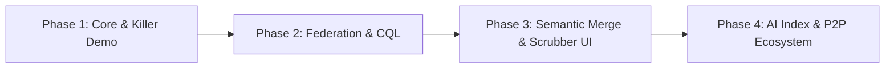

# CHRONO ROADMAP

This roadmap defines the four phases of CHRONO development, with strict criteria for what "Done" means at each milestone.

---

## Phase 1: Core Protocol & The Killer Demo
**Objective**: Build the minimum viable deterministic DAG engine and prove the concept with a single host adapter (VS Code).

### Deliverables
- [ ] **Core Graph**: Content-addressed state nodes, DAG traversal, ancestry resolution (`core/graph/node.ts`, `dag.ts`, `delta.ts`).
- [ ] **Logical Clock**: Vector clock and causality resolution (`core/clock/logical.ts`).
- [ ] **Storage Engine**: SQLite + WAL append-only persistence with BLAKE3 content addressing (`store/`).
- [ ] **Adapter SDK**: Base interface and capability declaration (`adapters/sdk/adapter.ts`, `capability.ts`).
- [ ] **VS Code Adapter**: Intercepts active editor document changes, buffer splices, and cursor positions (`adapters/vscode/`).
- [ ] **Deterministic Replayer**: Replay state from root/epoch + delta folds with 100% bitwise parity (`core/replay/replayer.ts`).
- [ ] **CLI**: `chrono init`, `chrono log`, `chrono checkout <node_id>`, `chrono replay` (`cli/`).

### Definition of Done (DoD)
A developer types code in VS Code, runs `chrono checkout <node_id>`, and the editor buffer jumps back in time instantly. Running `chrono replay` produces an identical historical state verified by hash match across 1,000 fuzzed edits.

---

## Phase 2: Multi-Adapter Federation & CQL
**Objective**: Synchronize multiple disparate applications into a single unified causal timeline and query with CQL.

### Deliverables
- [ ] **Daemon**: Local background daemon coordinating cross-adapter events over IPC/Unix domain sockets (`cli/daemon/`).
- [ ] **Terminal Adapter**: Intercepts shell command execution, working directory changes, and stdout/stderr exits (`adapters/terminal/`).
- [ ] **Filesystem Adapter**: Monitors workspace directory changes with debounce and change-clustering (`adapters/filesystem/`).
- [ ] **Epoch Bucketing**: Automated coarse checkpointing (every 50 deltas or 60s of inactivity) for $O(1)$ fast scrub lookup (`core/graph/epoch.ts`).
- [ ] **CQL Engine**: Lexer, Parser, AST, and Evaluator implementing the formal EBNF grammar (`query/cql/`).

### Definition of Done (DoD)
A developer runs a shell command that modifies a file while editing in VS Code. The unified DAG registers both the shell execution and the file mutation in causal order. Running `cql "SELECT state FROM branch('main') WHERE delta.type == 'FS_MUTATION'"` returns the exact state transitions.

---

## Phase 3: Semantic 3-Way Merge & Visual Scrubber
**Objective**: Transform CHRONO into an exploratory branching sandbox with visual time navigation and intelligent merging.

### Deliverables
- [ ] **Branching Subsystem**: Create, switch, and track parallel timeline branches (`core/graph/branch.ts`).
- [ ] **3-Way Merge Engine**: Find lowest common ancestor (LCA) in DAG and execute semantic delta reconciliation (`core/merge/strategies.ts`, `conflicts.ts`).
- [ ] **Visual Scrubber Component**: High-performance canvas/DOM timeline scrubber with node markers, zoomable time scales, and instant scrub response (`ui/scrubber/`).
- [ ] **Interactive Visual DAG**: Web-based or desktop timeline viewer visualizing active branches and merge points (`ui/branch-view/`).

### Definition of Done (DoD)
A developer forks their workspace into two divergent branches (`attempt-a` and `attempt-b`), makes structural modifications in both, and executes `chrono merge attempt-a attempt-b`. Non-conflicting semantic deltas auto-merge; conflicting regions trigger an interactive visual merge resolution dialog.

---

## Phase 4: Semantic AI Acceleration & P2P Replication
**Objective**: Accelerate timeline queries with local vector embeddings, natural-language compilation, and team sync.

### Deliverables
- [ ] **Local AI Provider**: On-device embedding generation (e.g., ONNX / local models) for semantic state indexing (`ai/providers/local.ts`).
- [ ] **Natural Language to CQL**: Zero-shot prompt compiler translating english queries to typed CQL ASTs (`query/nl/intent.ts`).
- [ ] **P2P Sync Engine**: Encrypted peer-to-peer branch replication for team collaboration over libp2p or WebRTC (`store/backends/remote.ts`).
- [ ] **Ecosystem Adapters**: Chrome/Browser tab state, Docker container state, and Window Manager active focus tracking (`adapters/browser/`, `adapters/window-manager/`).

### Definition of Done (DoD)
A developer asks `chrono query "when did we replace axios with fetch in the login handler?"`, the system compiles the query into CQL, searches the semantic index, and moves the playhead directly to the matching node within 200 milliseconds.
