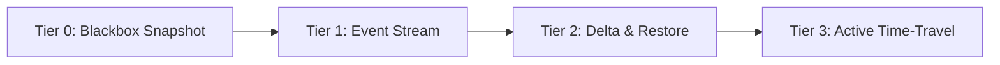

# CHRONO SPECIFICATION: ADAPTER CONTRACT

**Status**: Standard (Draft)  
**Version**: 1.0.0-draft  

---

## 1. Overview

An **Adapter** is the sovereign translation bridge between a host application environment (VS Code, shell PTY, browser runtime, CAD software, design tool) and the CHRONO DAG engine.

Because host applications possess vastly different internal architectures, the CHRONO Adapter Contract guarantees two invariants:
1. **Graceful Degradation**: An adapter can declare limited capabilities without breaking the global causal graph.
2. **Deterministic Rehydration**: If an adapter declares restore capability, it must guarantee that restoring to a node reconstructs the exact active host state.

---

## 2. Adapter Capability Tiers

Every adapter declares its tier during `chrono.handshake`:



| Tier | Name | Capabilities | Typical Applications |
|---|---|---|---|
| **Tier 0** | Blackbox Snapshot | Periodic full-state export on file save or timer. No reverse restore. | Legacy binary tools, monolithic databases, CAD suites. |
| **Tier 1** | Event Log Stream | Emits high-level user events (clicks, commands, HTTP requests). Read-only observation. | Analytics loggers, OS window managers. |
| **Tier 2** | Bidirectional Delta Stream | Emits fine semantic deltas (text splices, AST edits). Can accept `chrono.host.restore` to jump to any node. | Text editors, IDEs (VS Code, Neovim), CLI shells. |
| **Tier 3** | Active Time-Travel Bridge | Tier 2 + speculative branch simulation, multi-cursor presence, and live diff rendering in the host UI. | Native Chrono IDE plugins, reactive web clients. |

---

## 3. The TypeScript Interface Contract

Every adapter must implement the `ChronoAdapter` interface:

```typescript
export interface ChronoAdapter {
  /** Unique namespace identifier (e.g., "chrono.adapter.vscode") */
  readonly id: string;

  /** SemVer version of adapter implementation */
  readonly version: string;

  /** Declared capabilities matrix */
  readonly capabilities: AdapterCapabilities;

  /**
   * Lifecycle startup: establish connection with daemon, register listeners
   */
  initialize(context: AdapterContext): Promise<void>;

  /**
   * Produce a complete, self-contained snapshot of the host's current state.
   * Required for Tier 0, 2, and 3 adapters.
   */
  snapshot(): Promise<HostSnapshot>;

  /**
   * Apply a historical state to the host application (time-travel jump).
   * Required for Tier 2 and Tier 3 adapters.
   */
  restore(request: RestoreRequest): Promise<RestoreResult>;

  /**
   * Register a listener callback to emit semantic deltas as mutations occur in real time.
   */
  subscribeDeltas(listener: (delta: SemanticDelta) => Promise<void>): void;

  /**
   * Perform domain-specific semantic diff between two state snapshots.
   */
  diff(stateA: unknown, stateB: unknown): SemanticDelta[];

  /**
   * Clean shutdown of adapter and underlying listeners.
   */
  dispose(): Promise<void>;
}
```

---

## 4. Capability Declaration Schema

```typescript
export interface AdapterCapabilities {
  tier: 0 | 1 | 2 | 3;

  /** Can the adapter capture a full state snapshot on demand? */
  canSnapshot: boolean;

  /** Can the adapter rehydrate host state backwards to a past node? */
  canRestore: boolean;

  /** Does the adapter stream continuous real-time deltas? */
  canStreamDeltas: boolean;

  /** Can the adapter invert deltas (reverse scrub without full epoch fold)? */
  supportsInvertibleDeltas: boolean;

  /** List of state domains handled by this adapter */
  supportedDomains: Array<
    "text.buffer" |
    "workspace.files" |
    "terminal.pty" |
    "editor.selection" |
    "environment.variables" |
    "dom.tree"
  >;

  /** Maximum recommended snapshot size in bytes */
  maxSnapshotBytesLimit?: number;
}
```

---

## 5. Security & Secret Redaction Mandate

Before emitting any delta or snapshot to `chronod`, the adapter **MUST** run all payloads through the redaction sanitizer:

1. **Entropy Scanners**: Check for high-entropy strings matching API keys, JWT tokens, AWS credentials, and SSH private keys.
2. **Environment Filters**: Drop standard secrets (`*_TOKEN`, `*_SECRET`, `*_PASSWORD`, `AWS_*`, `GITHUB_TOKEN`).
3. **User-Configured Patterns**: Exclude files and variables specified in `.chronoignore`.

Nodes committed to the DAG are cryptographically hashed and immutable; leaking a secret into a node is permanent within that graph lineage.
