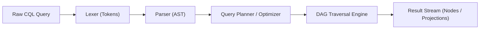

# CHRONO SPECIFICATION: CHRONO QUERY LANGUAGE (CQL)

**Status**: Standard (Draft)  
**Version**: 1.0.0-draft  

---

## 1. Overview

Chrono Query Language (CQL) is a declarative, strongly-typed domain-specific language designed for traversing, filtering, and projecting historical computational states across the CHRONO DAG.

---

## 2. Formal Grammar (EBNF)

```ebnf
Query            ::= SelectClause FromClause [ WhereClause ] [ OrderByClause ] [ LimitClause ] ";" ;

SelectClause     ::= "SELECT" ProjectionList ;
ProjectionList   ::= ProjectionItem ( "," ProjectionItem )* ;
ProjectionItem   ::= "*" 
                   | "node" 
                   | "state" 
                   | "delta" 
                   | "cid" 
                   | "clock" 
                   | "wall_time" 
                   | FunctionCall 
                   | PathExpression ;

FromClause       ::= "FROM" GraphSource ;
GraphSource      ::= BranchSource 
                   | LineageSource 
                   | EpochSource 
                   | "dag()" ;

BranchSource     ::= "branch(" StringLiteral ")" ;
LineageSource    ::= "lineage(" StringLiteral ")" ;
EpochSource      ::= "epoch(" ( IntegerLiteral | StringLiteral ) ")" ;

WhereClause      ::= "WHERE" Expression ;

Expression       ::= LogicalOrExpr ;
LogicalOrExpr    ::= LogicalAndExpr ( "OR" LogicalAndExpr )* ;
LogicalAndExpr   ::= EqualityExpr ( "AND" EqualityExpr )* ;
EqualityExpr     ::= RelationalExpr ( ( "==" | "!=" | "=~" | "!~" ) RelationalExpr )* ;
RelationalExpr   ::= AdditiveExpr ( ( "<" | "<=" | ">" | ">=" | "IN" ) AdditiveExpr )* ;
AdditiveExpr     ::= PrimaryExpr ;

PrimaryExpr      ::= Literal 
                   | PathExpression 
                   | FunctionCall 
                   | "(" Expression ")" 
                   | "NOT" PrimaryExpr ;

PathExpression   ::= Identifier ( "." Identifier | "[" ( StringLiteral | IntegerLiteral ) "]" )* ;

FunctionCall     ::= Identifier "(" [ ArgumentList ] ")" ;
ArgumentList     ::= Expression ( "," Expression )* ;

OrderByClause    ::= "ORDER" "BY" PathExpression [ "ASC" | "DESC" ] ;
LimitClause      ::= "LIMIT" IntegerLiteral [ "OFFSET" IntegerLiteral ] ;

Literal          ::= StringLiteral | IntegerLiteral | FloatLiteral | BooleanLiteral | "NULL" ;
StringLiteral    ::= "'" [^']* "'" | '"' [^"]* '"' ;
IntegerLiteral   ::= [0-9]+ ;
FloatLiteral     ::= [0-9]+ "." [0-9]+ ;
BooleanLiteral   ::= "TRUE" | "FALSE" ;
Identifier       ::= [a-zA-Z_][a-zA-Z0-9_]* ;
```

---

## 3. Built-in Functions

| Function | Signature | Description |
|---|---|---|
| `since(target)` | `since(epoch: String \| Int) -> Boolean` | Filters nodes causally after the specified epoch or node CID. |
| `before(target)` | `before(node_cid: String) -> Boolean` | Filters nodes causally prior to the target node. |
| `between(from, to)` | `between(a: String, b: String) -> Boolean` | Yields all nodes along the causal path between $a$ and $b$. |
| `diff(nodeA, nodeB)` | `diff(a: CID, b: CID) -> DeltaList` | Computes the aggregated semantic delta between two nodes. |
| `has_tag(tag)` | `has_tag(name: String) -> Boolean` | Checks if node annotations contain the specified tag. |
| `contains_text(str)` | `contains_text(query: String) -> Boolean` | Full-text substring search across delta payloads. |

---

## 4. Query Examples

### Example 1: Locate When an Exception or Failure Occurred
```sql
SELECT node, delta.target_uri, wall_time
FROM branch('main')
WHERE delta.type == 'terminal.exit' AND delta.forward.exit_code != 0
ORDER BY clock DESC
LIMIT 5;
```

### Example 2: Find All Changes to a Specific Authentication File
```sql
SELECT cid, wall_time, delta.forward
FROM branch('feature/auth-rework')
WHERE delta.target_uri == 'file:///workspace/src/auth.ts'
  AND since('epoch-4')
ORDER BY clock ASC;
```

### Example 3: Inspect Divergence Between Two Branches
```sql
SELECT diff(branch('main'), branch('experiment-b'))
FROM dag();
```

---

## 5. Execution Pipeline



1. **Lexical Analysis**: Source query decomposed into typed tokens.
2. **Parser**: Produces strongly typed `CqlQueryNode` AST.
3. **Planning & Pruning**: Evaluator checks `since()` or `branch()` predicates to bind the search domain to a minimal subtree in the DAG, avoiding full-table scans.
4. **Execution**: Streamed node evaluation with projection mapping.
