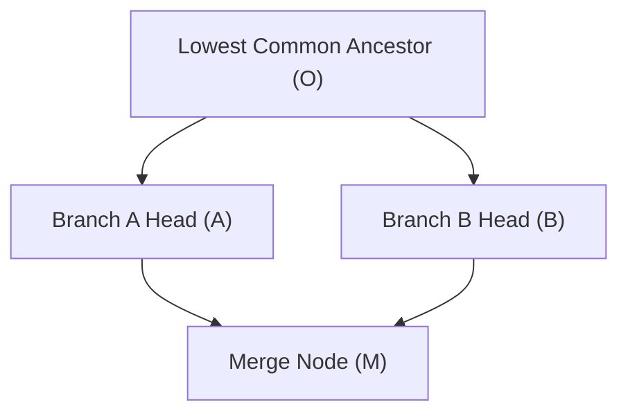

# CHRONO SPECIFICATION: MERGE SEMANTICS

**Status**: Standard (Draft)  
**Version**: 1.0.0-draft  

---

## 1. The Core Problem

Merging in CHRONO differs fundamentally from Git. Git merges line-oriented text files at discrete, infrequent commits. CHRONO merges **continuous, multi-adapter computational states** (active buffers, cursor states, terminal sessions, filesystem files).

Given two divergent branch heads $A$ and $B$, CHRONO must synthesize a new state node $M$ that reconciles the mutations performed in both timelines while preserving semantic integrity and determinism.



---

## 2. Merge Algorithm Pipeline

### Step 1: Lowest Common Ancestor (LCA) Discovery
Given nodes $A$ and $B$, find node $O$ such that:
$$O = \text{LCA}(A, B) = \arg\max_{v \in \text{Ancestors}(A) \cap \text{Ancestors}(B)} |\text{Lineage}(\text{Root} \to v)|$$

If multiple LCAs exist (criss-cross DAG topology), CHRONO constructs a virtual base by recursively merging the LCAs, or selects the LCA with the highest causal vector clock magnitude.

### Step 2: Lineage Delta Extraction
Compute the ordered sequence of deltas on each branch since $O$:
$$\mathcal{D}_A = [\Delta_{A,1}, \Delta_{A,2}, \dots, \Delta_{A,p}] \quad \text{such that } S_A = \text{Fold}(S_O, \mathcal{D}_A)$$
$$\mathcal{D}_B = [\Delta_{B,1}, \Delta_{B,2}, \dots, \Delta_{B,q}] \quad \text{such that } S_B = \text{Fold}(S_O, \mathcal{D}_B)$$

### Step 3: Domain Partitioning & Conflict Classification
Group deltas by target resource URI:
$$\mathcal{T} = \bigcup_{\Delta \in \mathcal{D}_A \cup \mathcal{D}_B} \text{target\_uri}(\Delta)$$

For each target $T \in \mathcal{T}$, evaluate the operations in $\mathcal{D}_A|_T$ against $\mathcal{D}_B|_T$:

| Case | Condition | Action |
|---|---|---|
| **Case 1: Disjoint Targets** | Target modified in $A$ but untouched in $B$ (or vice-versa). | **Auto-Apply**: Apply the modified branch's deltas directly. |
| **Case 2: Orthogonal Mutations** | Target modified in both, but regions/AST nodes are disjoint. | **Semantic Transform**: Re-base offset ranges via Operational Transformation (OT) and apply both. |
| **Case 3: Direct Mutation Collision** | Target modified in both, overlapping identical character spans, AST nodes, or conflicting lifecycle (e.g. Delete vs Edit). | **Conflict Detected**: Flag as unresolved conflict; prompt strategy or user resolution. |

---

## 3. Operational Transformation Rules for Text Splices

For text buffers with concurrent splices:
Let $\Delta_A = \text{Splice}(\text{pos}_A, \text{len}_A, \text{text}_A)$ and $\Delta_B = \text{Splice}(\text{pos}_B, \text{len}_B, \text{text}_B)$.

### 3.1 Non-Overlapping Splices
1. **If $\text{pos}_A + \text{len}_A \le \text{pos}_B$** ($A$ occurs strictly before $B$):
   - $\Delta_A$ is applied unchanged.
   - $\Delta_B$ is transformed: $\Delta_B' = \text{Splice}(\text{pos}_B + (|\text{text}_A| - \text{len}_A), \text{len}_B, \text{text}_B)$.
2. **If $\text{pos}_B + \text{len}_B \le \text{pos}_A$** ($B$ occurs strictly before $A$):
   - $\Delta_B$ is applied unchanged.
   - $\Delta_A$ is transformed: $\Delta_A' = \text{Splice}(\text{pos}_A + (|\text{text}_B| - \text{len}_B), \text{len}_A, \text{text}_A)$.

### 3.2 Overlapping Splices (Conflict)
If the intervals $[\text{pos}_A, \text{pos}_A + \text{len}_A]$ and $[\text{pos}_B, \text{pos}_B + \text{len}_B]$ intersect:
- If $\text{text}_A == \text{text}_B$ and $\text{len}_A == \text{len}_B$, the changes are idempotent: apply once.
- Otherwise, a `SemanticConflict` record is created.

---

## 4. Conflict Resolution Strategies

The merge engine supports four pluggable strategies:

### 4.1 Strategy `semantic_3way` (Default)
Executes semantic AST/OT merge. Automatically resolves non-overlapping structural and text mutations. If conflicts remain, emits conflict markers into the payload and presents them in the visual scrubber or CLI.

### 4.2 Strategy `ours` (Branch $A$ Precedence)
Takes branch $A$'s version for all conflicting targets, preserving $B$'s non-conflicting deltas.

### 4.3 Strategy `theirs` (Branch $B$ Precedence)
Takes branch $B$'s version for all conflicting targets, preserving $A$'s non-conflicting deltas.

### 4.4 Strategy `interactive`
Suspends merge completion. Launches the CHRONO diff/scrubber UI allowing the user to scrub each conflicting node individually, choose resolutions, and submit the final merge node.

---

## 5. The Merge Node Structure

When merge completes, the new node $M$ is written to the DAG:
```typescript
{
  "cid": "bafkmerge...",
  "parents": [cidA, cidB],
  "clock": VectorClock.join(clockA, clockB),
  "kind": "merge",
  "body": {
    "kind": "merge",
    "lca_cid": cidO,
    "strategy": "semantic_3way",
    "conflicts_resolved": [ ... ],
    "resolved_state": { ... }
  }
}
```

The vector clock for $M$ is computed as the pointwise maximum:
$$V_M[k] = \max(V_A[k], V_B[k]) \quad \forall k$$
This mathematically preserves the causal heritage of both parent branches.
