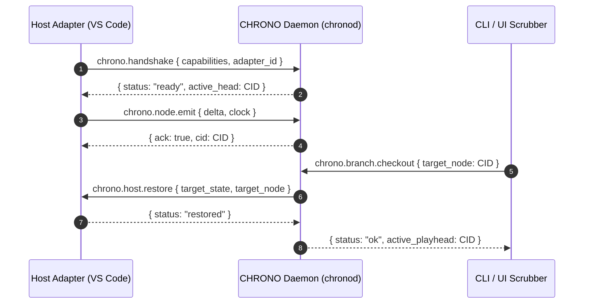

# CHRONO PROTOCOL SPECIFICATION

**Status**: Standard (Draft)  
**Version**: 1.0.0-draft  
**Transport**: Unix Domain Sockets (`/tmp/chrono.sock`) or Windows Named Pipes (`\\.\pipe\chrono-ipc`)  
**Framing**: Length-Prefixed JSON-RPC 2.0 or CBOR  

---

## 1. Protocol Architecture

The CHRONO Protocol coordinates three principal actors:
1. **Host Adapters**: Resident in applications (VS Code, PTY, Chrome, etc.). They observe mutations and emit deltas.
2. **CHRONO Daemon (`chronod`)**: The local background process managing the WAL, the DAG database, clock synchronization, and epoch generation.
3. **Clients / Frontends**: The CLI (`chrono`), UI Scrubber, and query tools interacting with the timeline.



---

## 2. Framing & Transport

### 2.1 Transport Layer
- **POSIX**: Unix Domain Socket at `${CHRONO_DIR:-~/.chrono}/run/chrono.sock`.
- **Windows**: Named Pipe at `\\.\pipe\chrono-${USER_HASH}`.

### 2.2 Framing Format
Each frame consists of a 4-byte big-endian unsigned integer indicating payload length, followed by the UTF-8 JSON-RPC 2.0 payload:
```
+-----------------------------------+------------------------------------------+
| Payload Length (4 bytes, BigEndian) | JSON-RPC 2.0 Payload (Length octets)    |
+-----------------------------------+------------------------------------------+
```

---

## 3. Core RPC Methods

### 3.1 `chrono.handshake`
Negotiates protocol version, adapter credentials, and capability tier.

#### Request
```json
{
  "jsonrpc": "2.0",
  "id": 1,
  "method": "chrono.handshake",
  "params": {
    "protocol_version": "1.0.0",
    "adapter_id": "chrono.adapter.vscode",
    "adapter_version": "1.2.0",
    "instance_id": "uuid-v4-client-instance",
    "capabilities": {
      "tier": 2,
      "can_snapshot": true,
      "can_restore": true,
      "can_stream_deltas": true,
      "supported_domains": ["text.buffer", "workspace.selection"]
    }
  }
}
```

#### Response
```json
{
  "jsonrpc": "2.0",
  "id": 1,
  "result": {
    "accepted": true,
    "daemon_version": "1.0.0",
    "active_branch": "main",
    "head_cid": "bafkr...blake3hash",
    "logical_clock": { "chrono.adapter.vscode": 42 },
    "epoch_interval_ms": 60000
  }
}
```

---

### 3.2 `chrono.node.emit`
Emitted by an adapter whenever a state mutation occurs.

#### Request
```json
{
  "jsonrpc": "2.0",
  "id": 2,
  "method": "chrono.node.emit",
  "params": {
    "parents": ["bafkoldparentcid..."],
    "kind": "delta",
    "wall_time": "2026-10-05T05:30:00.000Z",
    "body": {
      "kind": "delta",
      "delta": {
        "type": "text.splice",
        "target_uri": "file:///workspace/src/app.ts",
        "forward": {
          "range": { "start": 120, "end": 125 },
          "new_text": "renderView"
        },
        "reverse": {
          "range": { "start": 120, "end": 130 },
          "new_text": "render"
        },
        "context": {
          "cursor": { "line": 8, "character": 15 }
        }
      }
    }
  }
}
```

#### Response
```json
{
  "jsonrpc": "2.0",
  "id": 2,
  "result": {
    "cid": "bafknewnodecid...",
    "clock_seq": 43,
    "status": "persisted_to_wal"
  }
}
```

---

### 3.3 `chrono.host.restore` (Daemon $\to$ Adapter)
Dispatched by the daemon when a user moves the playhead or performs a checkout. The host adapter must mutate its host application to reflect the target state.

#### Request
```json
{
  "jsonrpc": "2.0",
  "id": 301,
  "method": "chrono.host.restore",
  "params": {
    "target_cid": "bafknodetarget...",
    "state": {
      "file:///workspace/src/app.ts": {
        "content": "function renderView() { ... }",
        "cursor": { "line": 8, "character": 15 }
      }
    },
    "deltas_from_current": [ ... ]
  }
}
```

#### Response
```json
{
  "jsonrpc": "2.0",
  "id": 301,
  "result": {
    "restored": true,
    "adapter_head": "bafknodetarget..."
  }
}
```

---

### 3.4 `chrono.query.execute`
Executes a raw CQL string or AST against the local DAG database.

#### Request
```json
{
  "jsonrpc": "2.0",
  "id": 4,
  "method": "chrono.query.execute",
  "params": {
    "cql": "SELECT state FROM branch('main') WHERE delta.type == 'text.splice' LIMIT 20;"
  }
}
```

#### Response
```json
{
  "jsonrpc": "2.0",
  "id": 4,
  "result": {
    "execution_time_ms": 1.4,
    "nodes": [ ... ]
  }
}
```

---

## 4. Standard Error Codes

| Code | Label | Meaning |
|---|---|---|
| `-32700` | `PARSE_ERROR` | Malformed JSON-RPC envelope. |
| `-32600` | `INVALID_REQUEST` | Missing required protocol fields. |
| `-32001` | `CID_NOT_FOUND` | Referenced node does not exist in local DAG. |
| `-32002` | `CAUSALITY_VIOLATION` | Node parents do not exist or violate clock causality. |
| `-32003` | `CAPABILITY_MISMATCH` | Action requires higher capability tier than adapter supports. |
| `-32004` | `REPLAY_DIVERGENCE` | Folded state checksum does not match expected node hash. |
| `-32005` | `MERGE_CONFLICT` | Unresolvable semantic conflict between branch heads. |
